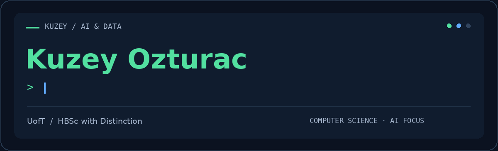
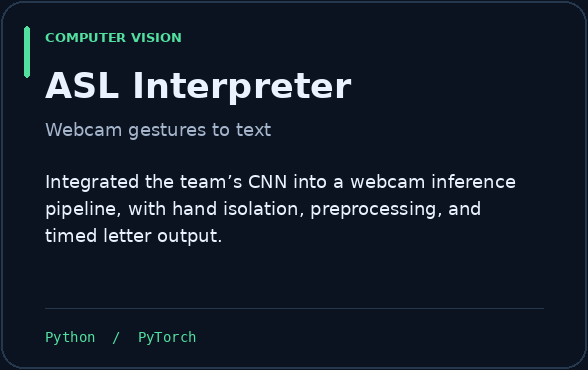
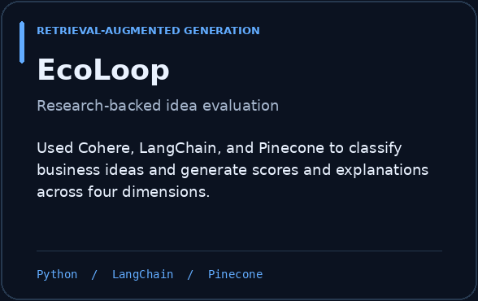
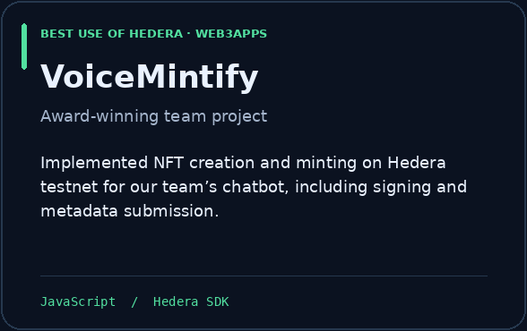
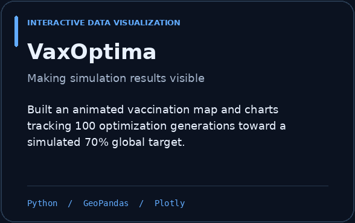

<!-- Upload this README.md and the assets folder to KuzeyOzturac/KuzeyOzturac. -->

  

  
  &nbsp;
  
  &nbsp;
  

 

<h2 align="center">A little context</h2>

  I’m a <b>University of Toronto Computer Science graduate</b> with an AI focus. 
  I build machine learning, computer vision, and data visualization projects, 
  connecting models and data to applications people can use.

<table align="center">
  <tr>
    <td align="center" width="33%"> <b>🎓 HBSc with Distinction</b> Dean’s List · 2023–2024  </td>
    <td align="center" width="34%"> <b>🏆 Best Use of Hedera</b> Team award · Web3Apps  </td>
    <td align="center" width="33%"> <b>📊 7 reports · 7 pharmacies</b> Business Intelligence Intern · Cencora  </td>
  </tr>
</table>

 

<h2 align="center">Selected builds</h2>

COMPUTER VISION &nbsp; / &nbsp; RAG &nbsp; / &nbsp; WEB3 &nbsp; / &nbsp; DATA

<table>
  <tr>
    <td width="50%"></td>
    <td width="50%"></td>
  </tr>
  <tr>
    <td width="50%"></td>
    <td width="50%"></td>
  </tr>
</table>

<a href="https://kuzeyozturac.github.io/portfolio/"><b>Explore my portfolio →</b></a>

 

<h2 align="center">My toolkit</h2>

LANGUAGES

  
  
  
  
  

AI &amp; MACHINE LEARNING

  
  
  
  

DATA &amp; VISUALIZATION

  
  
  
  

 

  
<b>Away from the editor</b>

   
  I enjoy history, strategy games, and creative projects with AI. My portfolio takes its visual inspiration from <b>Crusader Kings III</b>.
    
  I also spent three years tutoring and mentoring refugee and newcomer students at the London Cross Cultural Learner Centre, supporting their English, math, and adjustment to Canadian schools.
    

 

<b>Let’s build something worth using.</b>  
  Open to AI, machine learning, and data science opportunities. 
  <a href="mailto:kuzeyozturac2@gmail.com">Email me</a> &nbsp; · &nbsp; <a href="https://www.linkedin.com/in/kuzey-ozturac-077683266/">Find me on LinkedIn</a>

